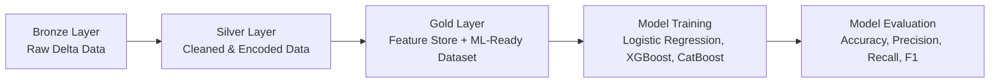

# 📊 Customer Churn Prediction Pipeline (Databricks + Medallion Architecture)

   

A scalable **end-to-end machine learning pipeline** built on **Databricks** following the **Medallion Architecture** (Bronze ➔ Silver ➔ Gold).
The pipeline performs **data ingestion with Autoloader**, feature engineering using **PySpark**, and **ML model training** using multiple classification algorithms (Logistic Regression, Random Forest, XGBoost, CatBoost).

---

## 🚀 Project Overview

This repository demonstrates a **production-ready churn prediction workflow**:

* **Bronze Layer** – Load raw data from Delta tables with Databricks Autoloader.
* **Silver Layer** – Clean, normalize, and encode categorical features with PySpark.
* **Gold Layer** – Prepare ML-ready feature set and train ML models using Scikit-learn, XGBoost, and CatBoost.

The final output is a **trained classification model** for predicting customer churn.

---

## 🏗️ Architecture (Medallion)



* **Bronze:** Raw ingestion using `spark.readStream.format("cloudFiles")` or batch `delta` reads.
* **Silver:** Data quality improvements, feature engineering, missing value handling, one-hot encoding.
* **Gold:** Bucketization, type casting, final schema for ML models.

---

## 🧩 Key Features

✅ **Databricks Autoloader** – Automatically detects and loads new data into Bronze.
✅ **PySpark Transformations** – Feature engineering at scale (One-Hot Encoding, Bucketization).
✅ **Medallion Architecture** – Clean, layered design for reproducibility and governance.
✅ **ML Training** – Logistic Regression, Random Forest, XGBoost, CatBoost, Neural Networks.
✅ **Metrics Tracking** – Accuracy, Precision, Recall, F1-score, Confusion Matrix, ROC-AUC.
✅ **Scalable & Modular** – Can be deployed to production with minimal changes.

---

## 📂 Repository Structure

```bash
.
├── notebooks/
│   ├──dev
│     ├── nb_raw    # Autoloader setup & raw data ingestion
│     ├── nb_bronze    # Data cleaning, feature encoding
│     └── nb_silver  # Final dataset for ML
│   ├──uat
│   ├──prod
├── .gitignore                 
├── README.md                         
└── LICENSE
```

---

## 🔑 Example Workflow

1. **Ingest Data**

```python
DATA_PATH = "/Volumes/workspace/bronze/bronzevolume/data/"
df = spark.read.format("delta").load(DATA_PATH)
```

2. **Feature Engineering**

* One-hot encode categorical columns
* Rename boolean columns (`Yes/No → 1/0`)
* Bucketize continuous variables (e.g., `MonthlyCharges`, `TotalCharges`)
* Cast all features to proper numeric types

3. **Train/Test Split**

```python
from sklearn.model_selection import train_test_split

X = pdf.drop("churn", axis=1)
y = pdf["churn"]

X_train, X_test, y_train, y_test = train_test_split(X, y, test_size=0.2, random_state=42)
```

4. **Model Training**

```python
from sklearn.linear_model import LogisticRegression

model = LogisticRegression(max_iter=2500)
model.fit(X_train, y_train)
y_pred = model.predict(X_test)
```

5. **Evaluation**

```python
from sklearn.metrics import accuracy_score, f1_score, classification_report

accuracy = accuracy_score(y_test, y_pred)
f1 = f1_score(y_test, y_pred)
print(f"Accuracy: {accuracy}, F1 Score: {f1}")
print(classification_report(y_test, y_pred))
```

---

## ⚡ Dependencies

* Python 3.9+
* Databricks Runtime (with PySpark)
* pandas, numpy, matplotlib, seaborn, plotly, missingno
* scikit-learn, xgboost, catboost

---

## 📜 License

## This project is licensed under the MIT License – see the [LICENSE](LICENSE) file for details.
